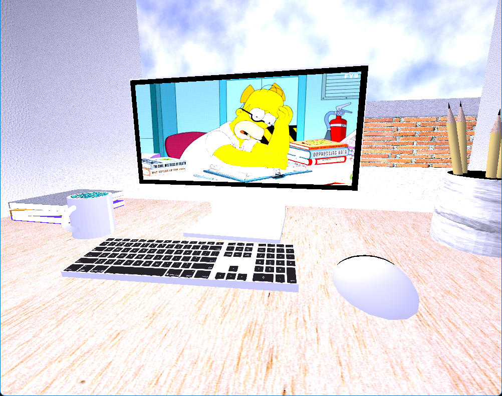

# OpenGL Example - Project Reflection

---
In this project I chose to create an office-like environment that consisted of a stack of books, pencil cup with pencils, coffee mug, computer, keyboard, and mouse. From the starting scene I added a window that the user is oriented to that has a view outside to a brick wall with a blue sky and green hedge. The intent behind the window was to add a level of depth to the room. The individual items themselves needed to be constructed with multiple mesh shapes. For example, the coffee cup on the desk is made up of a cylinder and half torus oriented so that the half torus is the handle to the mug. By using these predefined shapes that are built of potentially hundreds of triangles we’re able to quickly reuse and construct life like objects without having to custom map the mesh for each item. Items such as the contents on the computer screen and the keyboard are complex in nature and would require considerable development to accomplish. Instead, I applied textures to the objects with an image of these complex items as found in the real world. This strategy of wrapping objects in textures can be applied on many levels such as adding patterns and vegetation. 
 
As you build complex objects that are made up of multiple well-known shapes and wrap them in familiar textures, we start to create an illusion for the user that adds to their experience. To further this effect, I’ve added lighting of multiple color lights to the scene. Most computer screens emit blue light and as such I placed a lighting location at the same vector coordinates as the computer screen with blue ambient, diffuse, and specular lighting with considerable focal strength. This light is casted on other objects across the desk such as the mug that has a “shiny” quality to it and blue light can be seen breaking from its edges. The combination of ambient, diffuse, and specular lighting makes up what is known as combined or Phong lighting __(Vries, Basic Lighting, 2014)__. 
 
	The user can navigate the scene through industry standard controls, WASD for forward, backward, and side to side movement. Additionally, the user can press the R key to toggle the scroll wheel functionality. By default, the scroll wheel will adjust the movement speed associated with the WASD keys, but once you toggle with adjust the mouse movement speed. The user can use the O key to view the scene in a flattened Orthographic projection __(Vries, Coordinate Systems, 2014)__. Finally, the user can also use the P key to toggle to a perspective view of the scene which enables 3D modeling.  
  
	Throughout this project I adhered to industry standard best practices such as documenting my code thoroughly, creating doc-strings, and creating or using modular designs. One of these modular designs was creating the Object class. The object class is a general-purpose wrapper for the OpenGL driver. The Object class groups like functions that would logically be defined together such as applying UV-Scaling and Texture assignments together. Additionally, the class enables for reduced overhead in terms of the amount of code used and thus increasing readability. This is accomplished by using a singular Object class object that is assigned values while constructing a scene object. A developer can group like items together logically in the software that may share like attributes and no longer redefine the same attributes as the object class will retain its value. For example, I did not need to define all six pencils RGB values in my scene because I simply did not redefine the RGB value after assigning and rendering the first pencil.
 

---

### References
Vries, J. d. (2014). Basic Lighting. Retrieved from Learn OpenGL: https://learnopengl.com/Lighting/Basic-Lighting  
Vries, J. d. (2014). Coordinate Systems. Retrieved from Learn OpenGL: https://learnopengl.com/Getting-Started/Coordinate-Systems 
